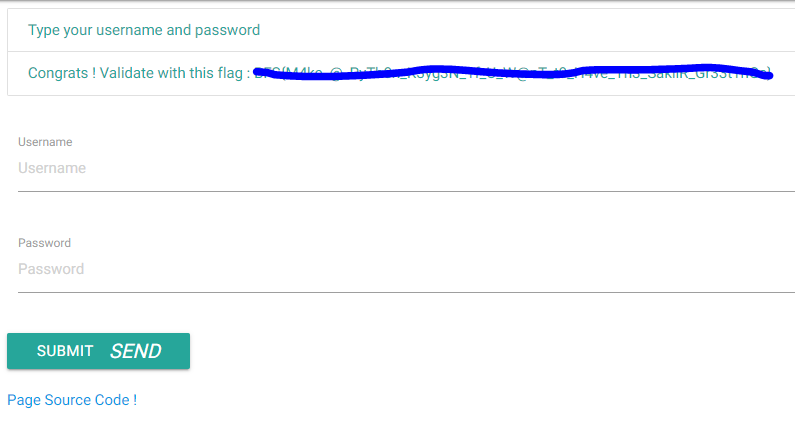

# Auth100

Dans ce second challenge, on arrive sur la même page que lors du précédent challenge.

A l'inverse, nous allons utiliser le code source de la page.
````PHP
for ($i = 0 ; $i < strlen($username) ; ++$i)  
	$sum += ord($username[$i]); // 1nTr3sT1nG, 15n't 1t ?  
if ($password === strval($sum)
	$message = 'Congrats ! Validate with this flag : '.$g_flag;
````

Ici, le programme additionne les valeurs ascii de chaque caractère pour générer un mot de passe
Du coup on se génère un mot de passe avec le username **'username'**.

````PHP
$username = 'username';
$sum = 0;
for ($i = 0 ; $i < strlen($username) ; ++$i)
	$sum += ord($username[$i]);
echo $sum;
````
````SHELL
864
````
On retourne sur le site et on entre la combinaison **'username' / '864'**

