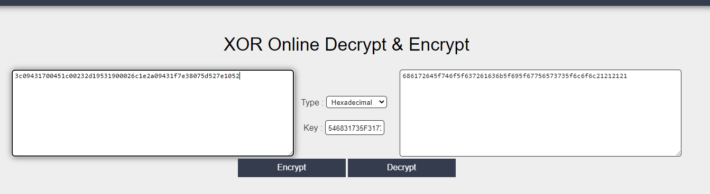
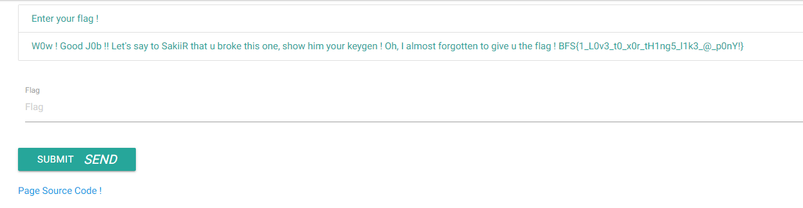

# Auth100

Dans ce troisième challenge, on arrive sur la même page que lors du précédent challenge.

Avec le code source on remarque que nous avons une chaîne hexa que à laquelle on applique un XOR
````PY
key = Th1s_1s_@_x0r_k3y_l0l!
hexaKey = 546831735F31735F405F7830725F6B33795F6C306C21
match = 3c09431700451c00232d19531900026c1e2a09431f7e38075d527e1052
````

Sur le site [XOR decrypt](https://md5decrypt.net/en/Xor/)
On rentre nos deux chaines en hexa sur le site et on récupère : **686172645f746f5f637261636b5f695f67756573735f6c6f6c21212121**

On convertit cette chaine en texte et on obtient la string suivante : **hard_to_crack_i_guess_lol!!!!**

On rentre ce flag sur le site pour valider le challenge

