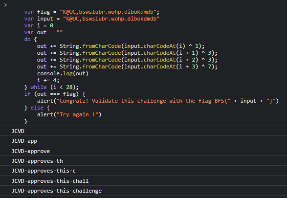
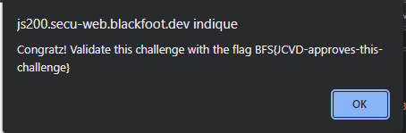

## JS200

Challlenge très rapide
On se rend à nouveau dans la console javascript du navigateur et on exécute le code de vérification du flag avec le pass comme flag pour voir comment se comporte le programme.

Tiens tiens JCVD semble aimer ce challenge il pourrait bien être notre flag !

