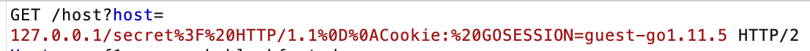

## SSRF 

Dans ce challenge on arrive sur une page qui nous demande de récupérer un flag en nous rendant sur 

```URL
https://ssrf1.secu-web.blackfoot.dev/secret
```


```
{
ok: false,
message: "You have to come from 127.0.0.1 not 172.21.0.8 :)",
flag: ""
}
```

Bien sûr on obtient cette réponse. On va donc essayer de trouver un moyen de détourner cette vérification côté serveur.

Du coup on va utiliser le formulaire pour faire une requête sur le port 80 de notre serveur.

Premier payloads qui n'a pas fonctionné

```URL
127.0.0.1/secret
```
=> 404 page not found. Celà est surement dû au fait que le server rajoute le port 80

 Sous burp on comprends fonctionne le méchanisme de reqûete

```URL
GET /host?host=127.0.0.1/secret%3F HTTP/2
```

Le serveur nous répond qu'il manque un cookie

On le rajoute à la suite de notre requête en modifiant le protocole HTTP vers 1.1 pour que notre requête soit envoyé en claire.


