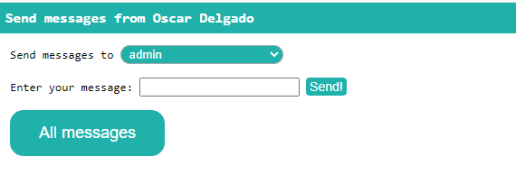
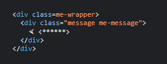
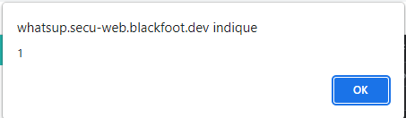
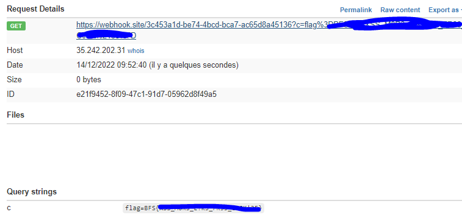

# Whatsup

Challenge d'injection XSS. 

On se retrouve sur l'interface d'un site de messagerie. On se doute rapidement que l'objectif ici est de récupérer le cookie stocké par le biais d'une injection dans l'input d'envoie de message.



On test alors l'envoi d'une balise

```HTML
<script></script>
```

On remarque que cette balise est filtré




On remarque rapidement que les autres balises utilisées dans des injections ne sont pas filtrées et permettent ici l'injection.

Exemple avec cette injection :

```HTML

```



On sait que cette injection fonctionne. On va donc l'utiliser et insérer dans le onerror :

```HTML

```

Ce payloads va venir charger l'url dans un webhook et charge les informations qu'on lui demande. Ici c'est document.cookie qu'on charge dans une variable c.
On va venir charger la liste des cookies.

On envoie le message et on attends une réponse sur notre webhooks. 

Après quelques secondes, notre webhooks réussi à récupérer un cookie qui ressemble à notre flag


