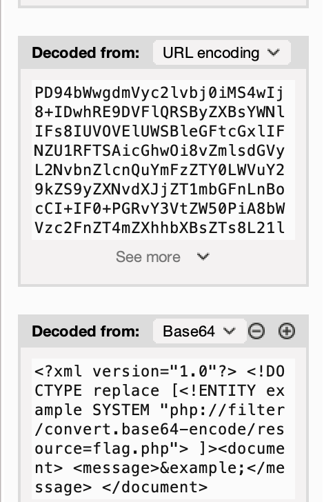
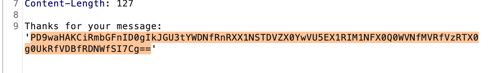

## XXE

Dans le fichier index.html on découvre la présence d'un fichier flag.php. Et si on essayait d'injecter un filtre comme dans les précédent challenges pour essayer d'accèder à la ressource :) 

Parce que les images valent parfois plus que les mots

